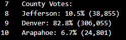
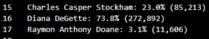
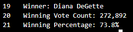

# Election_Analysis

## Project overview
In this project I am going to process election data of US congressional precinct in Colorado and report:
1. The total number of votes cast
2. The complete list of candidates who received votes
3. The total number of votes for each candidate
4. The percentage of votes for each candidate
5. The winner of the election based on the popular vote

## Resources
- Data Source: election_results.csv
- Software: Python 3.10.0, Visual Studio 1.62.1

## Summary
The analysis of the election shows that:
1. The total number of votes is 369.711
2. Candidates names:
- Charles Casper Stockham
- Diana DeGette
- Raymon Anthony Doane
3. The total number and percentage of votes for each canidate:
- Charles Casper Stockham received 85,213 votes and 23.0% of the vote
- Diana DeGette received 272,892 votes and 73.8% of the vote
- Raymon Anthony Doane received 11,606 votes and 3.1% of the vote
4. The winner of the election is 
- Diana DeGette who received 272,892 votes and 73.8% of the vote

## Challenge overview

I this challenge I needed to 

1. Calculate the total votes cast

2. Provide a breakdown of the number of votes and the percentage of total votes for each county in the precinct

3. Find the county with the largest number of votes
4. Provide a breakdown of the number of votes and the percentage of the total votes each candidate received
5. Find what candidate won the election, what was their vote count, and what was their percentage of the total votes
6.  Provide a business proposal to the election commission on how this script can be used—with some modifications—for any election.

## Election-Audit Results

- How many votes were cast in this congressional election?

   369.711 votes were cast  in this election. 

  

  To find this number I 

  1. Imported os and csv modules to add our dependencies:

     ```ruby
     import csv
     import os
     ```

  2. Added a variable to load a file from a path

     ```ruby
     file_to_load = os.path.join("resources", "election_results.csv")
     ```

  3. Added a variable to save the file to a path

     ```ruby
     file_to_save = os.path.join("analysis", "election_results.txt")
     ```

  4. Initialized a total vote counter

     ```ruby 
     total_votes = 0
     ```

  5. Read the csv and convert it into a list of dictionaries

     ```ruby
     with open(file_to_load) as election_data:
         reader = csv.reader(election_data)
     ```

  6. Read and skipped the header

     ```ruby
     	header = next(reader)
     ```

  7. For each row in the CSV file

     ```ruby
     	for row in reader:
             # Add to the total vote count
             total_votes = total_votes + 1
     ```

  8. Printed and saved the results to our text file

     ```ruby
     with open(file_to_save, "w") as txt_file:
         # Print the final vote count (to terminal)
         election_results = (
             f"\nElection Results\n"
             f"-------------------------\n"
             f"Total Votes: {total_votes:,}\n"
             f"-------------------------\n\n"
             )
         print(election_results, end="")
     
         txt_file.write(election_results)
     ```

- Provide a breakdown of the number of votes and the percentage of total votes for each county in the precinct.

  Jefferson county got 10.5% (38,855) of the votes
  Denver county  got  82.8% (306,055) of the votes
  Arapahoe county got 6.7% (24,801) of the votes

  

- Which county had the largest number of votes?

  Largest county turnout: Denver with 82.8% (306,055) of the votes

- Provide a breakdown of the number of votes and the percentage of the total votes each candidate received.

  Charles Casper Stockham got  23.0% (85,213) of the votes
  Diana DeGette got 73.8% (272,892) of the votes
  Raymon Anthony Doane got 3.1% (11,606) of the votes

  

- Which candidate won the election, what was their vote count, and what was their percentage of the total votes?

​		Diana DeGette won the election with 73.8% (272,892) of the votes



## Challenge summary

This code can be used for any elections. 

For instance, general president elections. If we add a list of states and a dictionary for state votes we can get total number of votes and percentage for each state additionally to each county's votes and percentage and winning candidate and their total number of votes and percentage. Also we can add another dictionary candidate_in_state_votes and count candidates' votes and percentage in each particular state using for-loops and if-statements.

Another election that can be counted by this code is school board election. We can change counties to zip-codes and get the total amount and percentage of votes for each zip-code  as well as winning candidate's votes amount and their percentage.
